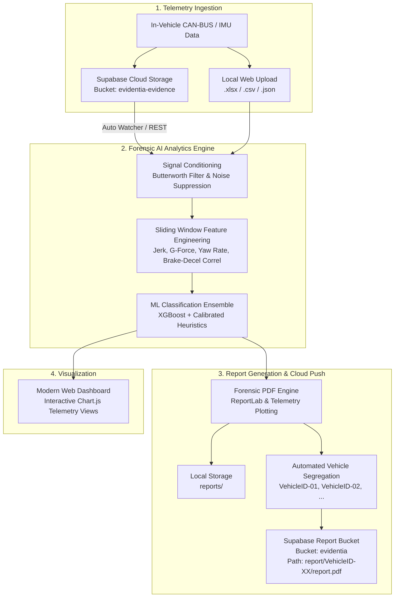

# Evidentia Forensic AI 🚗⚡🔍

[](https://www.python.org/downloads/)
[](https://xgboost.readthedocs.io/)
[](https://supabase.com/)
[](LICENSE)

> **Next-Generation Vehicle Telemetry Intelligence & Automated Accident Forensic Investigation Platform**

Evidentia Forensic AI is an end-to-end AI-powered vehicle crash analytics and incident reconstruction system. It ingests high-frequency raw telemetry (IMU, CAN-BUS, GPS, accelerometer, braking, and steering data), extracts forensic signal features, determines root cause accident drivers using an ensemble of calibrated ML models, and produces certified forensic PDF reports ready for insurance adjusters, fleet operators, and legal investigators.

---

## 📌 Architecture & Data Flow



---

## ✨ Key Capabilities

- **Automated Root-Cause Forensics**: Classifies crash dynamics into critical operational categories:
  - `possible_collision_impact` (Sudden longitudinal/lateral G-force spikes, speed drop)
  - `possible_brake_failure` (100% brake pedal engagement with zero deceleration)
  - `rash_driving` (Aggressive swerving, high-frequency lane cutting, unsafe acceleration)
  - `sharp_turning_or_skid` (Yaw rate anomalies and lateral traction loss)
  - `hard_braking` (Emergency deceleration profiles)
  - `normal_driving` (Baseline operational parameters)
- **Advanced Digital Signal Processing**:
  - 4th-order Butterworth low-pass filtering to remove sensor high-frequency vibration noise.
  - Multi-axis jerk calculation ($\frac{da}{dt}$) and 3D resultant G-force computation.
- **Dual Supabase Cloud Architecture**:
  - **Source Pipeline**: Ingests accident telemetry directly from cloud storage buckets or database tables.
  - **Auto-Sync Watcher**: Runs continuously in the background, detects newly pushed telemetry, analyzes it, and generates results without human intervention.
  - **Destination Pipeline**: Uploads forensic reports to dedicated vehicle hierarchy folders (`report/VehicleID-XX/<report>.pdf`).
- **Insurance-Grade Forensic PDF Reports**:
  - Timestamped chronological incident breakdown.
  - Telemetry curves (Speed vs. Brake, Accelerometer G-forces, Steering Yaw).
  - Driver culpability indicators and mechanical failure probability indices.
- **Modern Interactive Dashboard**:
  - Clean web interface with multi-channel telemetry graphs powered by Chart.js.
  - Built-in one-click demo incident presets (Collision Impact, Rash Driving, Brake Failure).

---

## 🛠️ Tech Stack

| Layer | Technologies |
|---|---|
| **Machine Learning** | XGBoost, Scikit-Learn, Joblib, NumPy, Pandas, SciPy |
| **Backend & APIs** | Python 3.10+, Flask, Werkzeug, Urllib (REST API) |
| **PDF Generation** | ReportLab, Matplotlib |
| **Frontend** | HTML5, Vanilla CSS3 (Custom Design System), JavaScript (ES6+), Chart.js |
| **Cloud Storage** | Supabase Storage & PostgreSQL Telemetry Tables |

---

## 📂 Project Structure

```text
DriveOpsAI/
├── data/                       # Telemetry data, samples, vehicle registry
│   ├── cloud_evidence/         # Downloaded telemetry from Supabase
│   ├── vehicle_registry.json   # Persistent Vehicle ID tracker (VehicleID-01, etc.)
│   └── sample_*.csv            # Pre-configured test telemetry files
├── models/                     # Trained ML models & calibration assets
│   ├── xgboost_model.pkl       # Core XGBoost multi-class classifier
│   ├── scaler.pkl              # MinMax / Standard normalizer
│   ├── label_map.pkl           # Forensic cause class mappings
│   └── heuristic_config.json   # Calibrated safety boundary limits
├── reports/                    # Locally generated forensic PDF reports
├── web/                        # Web dashboard assets
│   ├── css/style.css           # Modern glassmorphism UI styles
│   ├── js/app.js               # Interactive frontend logic & Chart.js renderer
│   ├── index.html              # Main web portal
│   └── img2.png                # Brand logo asset
├── launch_all.bat              # One-click dual service launcher
├── launch_cloud_watcher.bat    # Background cloud storage polling service
├── report_generator.py         # Legal & insurance forensic PDF generator
├── supabase_client.py          # Supabase REST client (ingestion & upload)
├── supabase_config.json        # Supabase API credentials & bucket endpoints
├── test_model.py               # Feature extraction & inference engine
├── train_accident_cause_model.py # Model training & SMOTE pipeline
├── watch_cloud_evidence.py     # Real-time automated cloud queue listener
└── web_server.py               # Flask backend REST server
```

---

## 🚀 Quick Start Guide

### 1. Prerequisites
Ensure you have **Python 3.10+** installed:
```powershell
python --version
```

### 2. Clone the Repository
```powershell
git clone https://github.com/koushik-ops/EvidentiaAI.git
cd EvidentiaAI
```

### 3. Install Dependencies
```powershell
pip install numpy pandas matplotlib scikit-learn joblib reportlab flask xgboost openpyxl
```

### 4. Configure Supabase Cloud (Optional)
Edit `supabase_config.json` with your credentials:
```json
{
  "supabase_url": "https://your-source-project.supabase.co",
  "supabase_key": "your_source_api_key",
  "bucket_name": "evidentia-evidence",
  "folder_prefix": "accidents",
  "table_name": "telemetry",
  "report_supabase_url": "https://your-destination-project.supabase.co",
  "report_supabase_key": "your_destination_api_key",
  "report_bucket_name": "evidentia",
  "report_folder_prefix": "report",
  "auto_upload_reports_to_cloud": true,
  "auto_analyze_on_fetch": true
}
```

### 5. Launch All Services
Run the automated launcher:
```powershell
.\launch_all.bat
```
This starts:
1. **Cloud Evidence Watcher** (monitoring remote Supabase bucket for new telemetry)
2. **Web Dashboard Server** (available at [http://localhost:5000](http://localhost:5000))

---

## 📊 Telemetry Data Specification

The engine accepts `.xlsx`, `.csv`, or `.json` files containing vehicle telemetry sampled at 10 Hz – 100 Hz. Key recommended channels:

| Parameter | Recommended Unit | Description |
|---|---|---|
| `Speed` / `vehicle_speed` | km/h or m/s | Longitudinal vehicle speed |
| `Acceleration_X` | m/s² or G | Longitudinal acceleration / braking |
| `Acceleration_Y` | m/s² or G | Lateral acceleration / cornering |
| `Acceleration_Z` | m/s² or G | Vertical acceleration / road impact |
| `Brake` / `Brake_Pressure` | % or bar | Driver brake pedal application |
| `Steering_Angle` | degrees | Steering wheel angle position |
| `Yaw_Rate` | deg/s | Vehicle rotational velocity |

---

## 📄 Forensic Report Output

Generated PDF forensic reports contain:
1. **Accident Summary Banner**: Primary cause classification with statistical confidence score.
2. **Incident Chronology**: Second-by-second timeline reconstruction prior to and during impact.
3. **Synchronized Waveform Plots**: Speed drop vs. brake application vs. 3-axis G-forces.
4. **Mechanical vs. Human Factor Attribution**: Automated liability indicator for claims analysis.
5. **Direct Cloud Archival**: Automatic upload to `report/VehicleID-XX/<filename>_Forensic_Report.pdf`.

---

## 🔒 Security & Data Privacy

- Telemetry credentials and service role keys are managed through isolated local configuration (`supabase_config.json`).
- Ensure `supabase_config.json` is added to `.gitignore` when deploying to public repositories.

---

## 👤 Author

Developed by **[Koushik Deb](https://github.com/koushik-ops)**  
Repository: [koushik-ops/EvidentiaAI](https://github.com/koushik-ops/EvidentiaAI)
